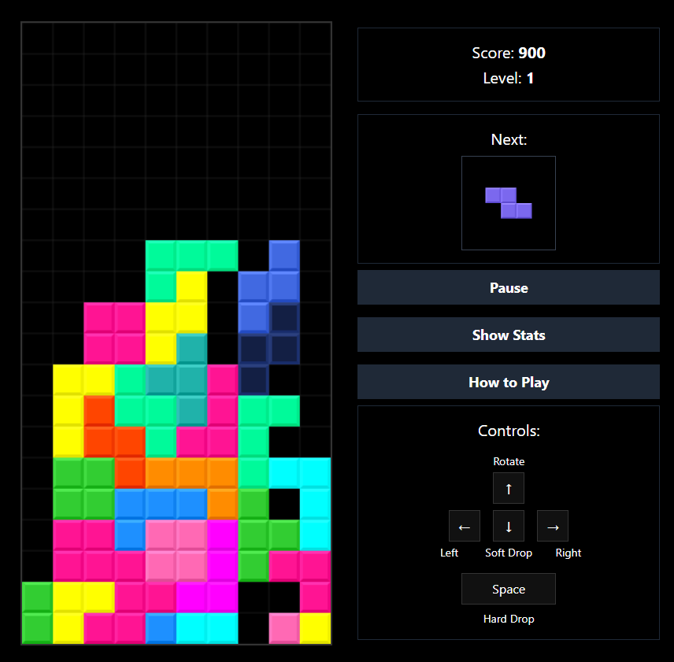
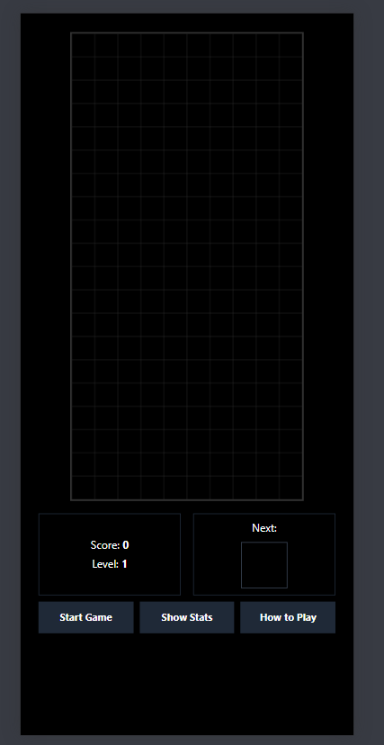
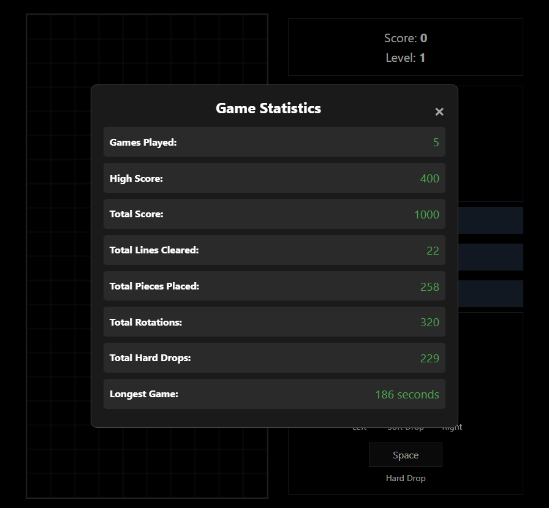
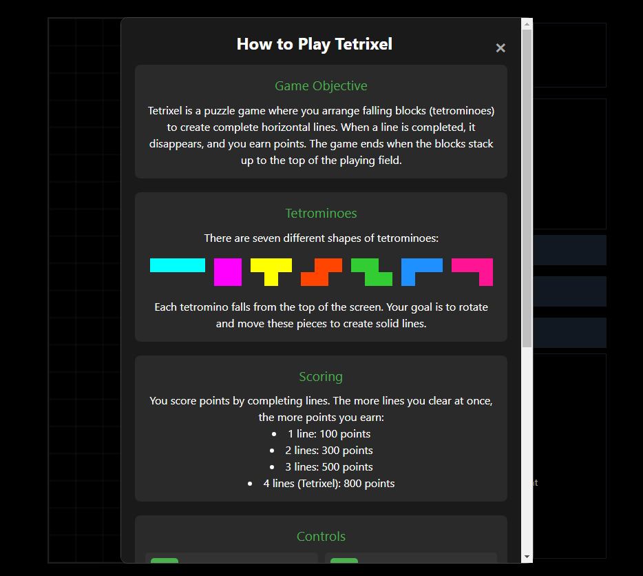

# 🧩 Tetrixel

Tetrixel is a modern, pixel-perfect implementation of the classic Tetris game, built as a Progressive Web App (PWA) using vanilla JavaScript, HTML5, and CSS3. It offers a seamless gaming experience across desktop and mobile devices, with a focus on smooth performance and engaging gameplay.

## 🌟 Features

- 🎮 Classic Tetris gameplay with a modern, sleek interface
- 📱 Fully responsive design for optimal play on both desktop and mobile
- 🚀 Progressive Web App (PWA) functionality for offline play and easy installation
- 🌈 Vibrant, customizable color schemes for a personalized experience
- 📊 Comprehensive real-time statistics tracking
- 🏆 Local high score system to track your best performances
- 👆 Intuitive touch controls for mobile users
- 🖥️ Keyboard controls for desktop players
- 👻 Ghost piece feature for precise placements
- 🔄 "Next piece" preview for strategic planning

## 🚀 Live Demo

Experience Tetrixel now: [Play Tetrixel](https://mohdyahyamahmodi.github.io/tetrixel/)

## 📱 Cross-Platform Experience

Tetrixel is designed to provide a consistent and enjoyable experience across all devices. The game adapts its interface and controls to suit both desktop and mobile environments.

  

    
    
<strong>Large Screens: Desktop Gameplay</strong>

  

  

    
    
<strong>Mobile: Touch-Optimized Interface</strong>

  

### Desktop Experience
- Use arrow keys for movement and rotation
- Spacebar for hard drop
- Large game board for precise movements

### Mobile Experience
- Intuitive swipe controls for movement
- Tap to rotate pieces
- Optimized layout for smaller screens

## 📊 Statistics Tracking

Tetrixel features a comprehensive statistics tracking system, accessible to players on both mobile and desktop platforms. This system provides valuable insights into your gameplay and progress over time.

  

### Tracked Statistics

1. **Games Played**: Total number of games you've played
2. **High Score**: Your highest achieved score
3. **Total Score**: Cumulative score across all games
4. **Total Lines Cleared**: Total number of lines you've cleared
5. **Total Pieces Placed**: Number of tetromino pieces you've placed
6. **Total Rotations**: How many times you've rotated pieces
7. **Total Hard Drops**: Number of times you've used the hard drop feature
8. **Longest Game**: Duration of your longest single game session

These statistics are persistently stored using the browser's local storage, allowing you to track your progress across multiple sessions.

## 🎓 How to Play

New to Tetrixel or need a refresher? Our "How to Play" guide is available on both mobile and desktop, providing clear instructions on game mechanics, controls, and scoring.

  

The guide covers:
- Basic game objectives
- Controls for both desktop and mobile
- Scoring system
- Tips for improving your gameplay

## 🛠️ Technical Implementation

Tetrixel is built using vanilla JavaScript, HTML5, and CSS3, showcasing the power of modern web technologies without relying on heavy frameworks.

### Key Technical Features:

1. **Canvas Rendering**: The game board is rendered using HTML5 Canvas, providing smooth graphics and animations.

2. **Responsive Design**: CSS media queries and flexible layouts ensure the game looks great on any device.

3. **Touch Controls**: Implemented using the Hammer.js library for smooth and responsive touch interactions on mobile devices.

4. **PWA Capabilities**: 
   - Service Worker for offline caching
   - Web App Manifest for "Add to Home Screen" functionality
   - Optimized assets for fast loading

5. **Local Storage**: Used for persisting game statistics and high scores.

6. **Modular JavaScript**: The game logic is organized into clear, modular functions for easy maintenance and expandability.

## 🎨 Customization

Tetrixel offers customization options for developers and enthusiasts:

1. **Color Schemes**: Modify the `COLORS` array in `tetris.js` to create your own unique color palettes.

2. **Game Physics**: Adjust variables like `dropInterval` to change the game's pace.

3. **Board Size**: Modify `ROWS` and `COLS` constants to create different board sizes.

## 🚀 Future Enhancements

We're constantly working to improve Tetrixel. Planned features include:

- 🔊 Sound effects and background music
- 🌐 Online leaderboards
- 🎨 Additional themes and visual effects
- 🏆 Achievements system

## 🤝 Contributing

We welcome contributions to Tetrixel! Whether it's bug fixes, new features, or improvements to the documentation, your input is valuable. Please feel free to submit a Pull Request or open an Issue for discussion.

## 📄 License

Tetrixel is open source and available under the [MIT License](LICENSE). Feel free to use, modify, and distribute the code as per the license terms.

## 🙏 Acknowledgements

- Inspired by the timeless classic Tetris
- Built with passion for the gaming and web development communities
- Special thanks to all contributors and players who have helped shape Tetrixel

---

Enjoy playing Tetrixel! If you find it fun and engaging, please consider giving the repository a star ⭐. Your support motivates us to keep improving the game!
